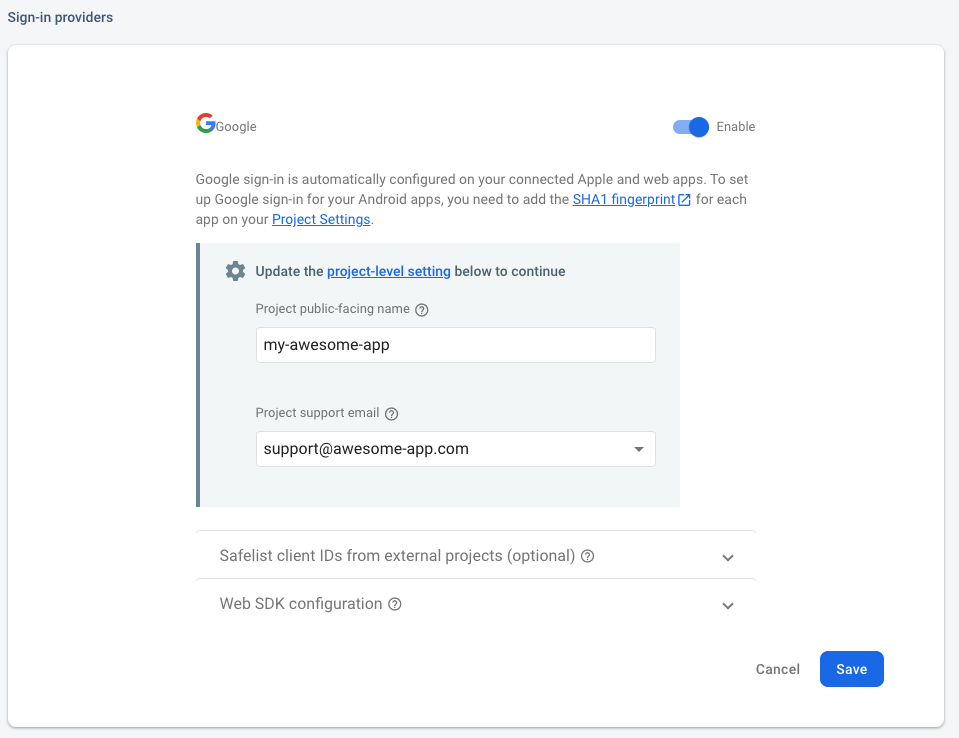
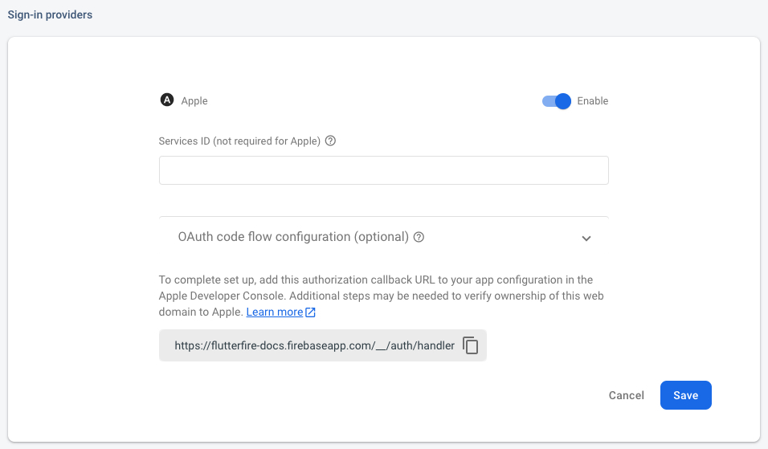
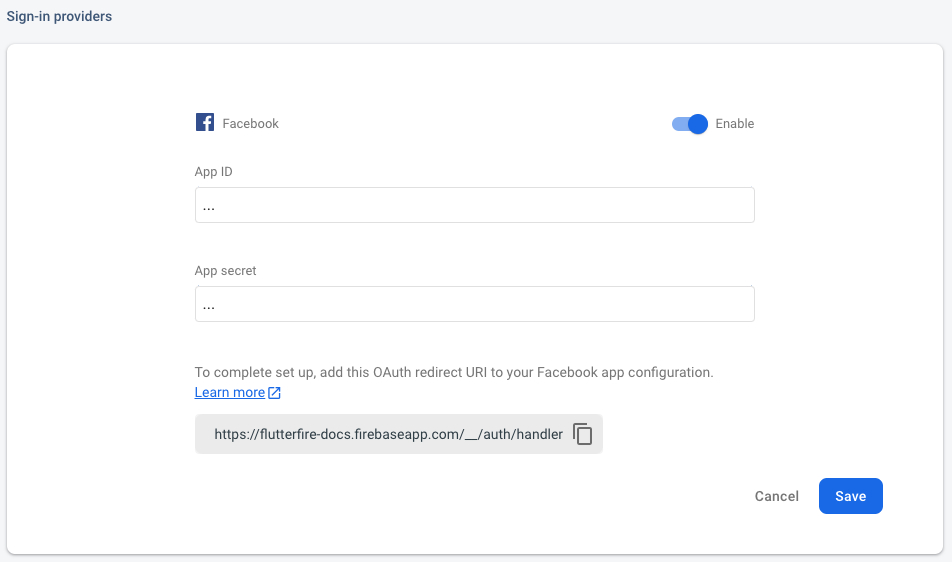
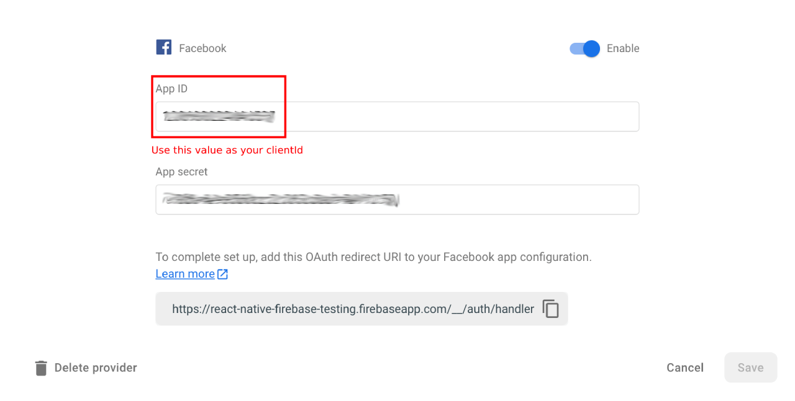
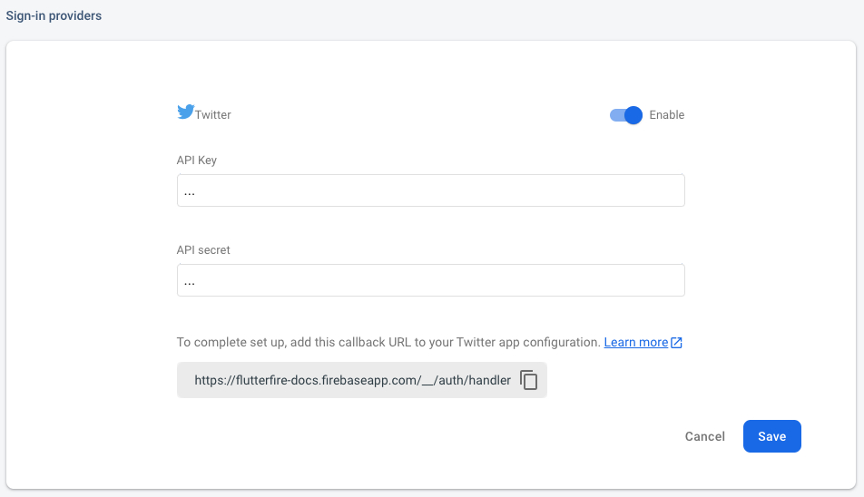
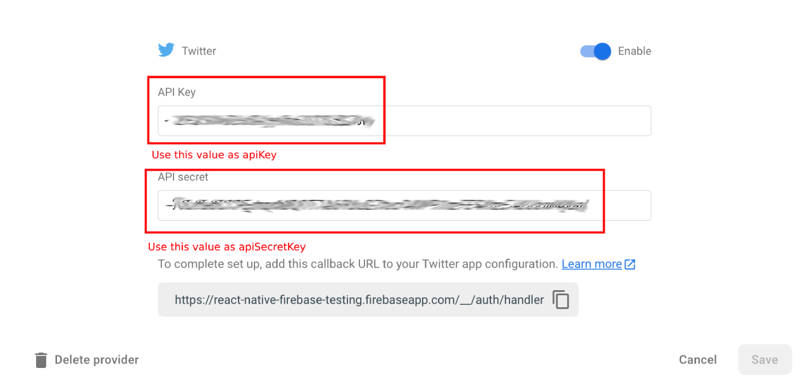

# Firebase UI OAuth

## Google Sign In

To support Google as a provider, first install the official [`google_sign_in`](https://pub.dev/packages/google_sign_in) plugin to your project as described in the README.

❗️ Important: you need go through configuration steps for each platform as described on the [README](https://pub.dev/packages/google_sign_in).

Next, enable the "Google" provider in the Firebase Console:



> To ensure cross-platform support, please ensure you have followed installation instructions for both the `google_sign_in` package and the provider on the Firebase Console (such as adding a [SHA1 fingerprint](https://developers.google.com/android/guides/client-auth?authuser=0) for Android applications).

You will also need to install [`firebase_ui_oauth_google`](https://pub.dev/packages/firebase_ui_oauth_google):

```sh
flutter pub add firebase_ui_oauth_google
```

And add a provider to the configuration:

```dart
Future<void> main() async {
  WidgetsFlutterBinding.ensureInitialized();
  await Firebase.initializeApp(options: DefaultFirebaseOptions.currentPlatform);

  FirebaseUIAuth.configureProviders([
    GoogleProvider(clientId: GOOGLE_CLIENT_ID),
  ]);
}
```

Now all pre-built screens that support multiple providers (such as `RegisterScreen`, `SignInScreen`, `ProfileScreen` and others) will have a themed button.

The configuration requires the `clientId` property (which can be found in the Firebase Console) to be set for seamless cross-platform support.


See [Custom screens section](#custom-screens) to learn how to use a button on your custom screen.

## Sign in with Apple

To support Apple as a provider, enable the "Apple" provider in the Firebase Console:



You will also need to install [`firebase_ui_oauth_apple`](https://pub.dev/packages/firebase_ui_oauth_apple):

```sh
flutter pub add firebase_ui_oauth_apple
```

And add a provider to the configuration:

```dart
Future<void> main() async {
  WidgetsFlutterBinding.ensureInitialized();
  await Firebase.initializeApp(options: DefaultFirebaseOptions.currentPlatform);

  FirebaseUIAuth.configureProviders([
    AppleProvider(),
  ]);
}
```

Now all pre-built screens that support multiple providers (such as `RegisterScreen`, `SignInScreen`, `ProfileScreen` and others) will have a themed button. See [Custom screens section](#custom-screens) to learn how to use a button on your custom screen.

## Flutter Facebook Auth

To support Facebook as a provider, first install the [`flutter_facebook_auth`](https://pub.dev/packages/flutter_facebook_auth)
plugin to your project. Each platform requires that you follow the [installation process](https://facebook.meedu.app) as specified
in the documentation.

Next, enable the "Facebook" provider in the Firebase Console & provide your created Facebook App ID and secret:



You will also need to install [`firebase_ui_oauth_facebook`](https://pub.dev/packages/firebase_ui_oauth_facebook):

```sh
flutter pub add firebase_ui_oauth_facebook
```

And add a provider to the configuration:

```dart
Future<void> main() async {
  WidgetsFlutterBinding.ensureInitialized();
  await Firebase.initializeApp(options: DefaultFirebaseOptions.currentPlatform);

  FirebaseUIAuth.configureProviders([
    FacebookProvider(clientId: FACEBOOK_CLIENT_ID),
  ]);
}
```

Now all pre-built screens that support multiple providers (such as `RegisterScreen`, `SignInScreen`, `ProfileScreen` and others) will have a themed button.

The configuration requires the `clientId` property (which can be found in the Firebase Console) to be set for seamless cross-platform support.



See [Custom screens section](#custom-screens) to learn how to use a button on your custom screen.

## Twitter Login

To support Twitter as a provider, first install the [`twitter_login`](https://pub.dev/packages/twitter_login)
plugin to your project and make sure you've performed necessary configuration as described on [README](https://pub.dev/packages/twitter_login).

Next, enable the "Twitter" provider in the Firebase Console:



You will also need to install [`firebase_ui_oauth_twitter`](https://pub.dev/packages/firebase_ui_oauth_twitter):

```sh
flutter pub add firebase_ui_oauth_twitter
```

And add a provider to the configuration:

```dart
Future<void> main() async {
  WidgetsFlutterBinding.ensureInitialized();
  await Firebase.initializeApp(options: DefaultFirebaseOptions.currentPlatform);

  FirebaseUIAuth.configureProviders([
    TwitterProvider(
      apiKey: TWITTER_API_KEY,
      apiSecretKey: TWITTER_API_SECRET_KEY,
    ),
  ]);
}
```

Now all pre-built screens that support multiple providers (such as `RegisterScreen`, `SignInScreen`, `ProfileScreen` and others) will have a themed button.

You can get the `apiKey` and `apiSecretKey` from the Firebase Console or [twitter developer portal](https://developer.twitter.com/en/portal/projects-and-apps).



Providing the `apiSecretKey` directly is not advised if you are building for the web. Instead, you can use "dart-define" to ensure that the value is omitted from web builds:

```bash
flutter run --dart-define TWITTER_SECRET=<your-twitter-api-secret-key>
```

When building the app on platforms other than the web, the `TWITTER_SECRET` environment variable can be defined using:

```dart
apiSecretKey: String.fromEnvironment('TWITTER_SECRET', ''),
```

See [Custom screens section](#custom-screens) to learn how to use a button on your custom screen.

## Custom screens

If you want to use a button on your custom screen, use `OAuthProviderButton`:

```dart
class MyCustomScreen extends StatelessWidget {
  const MyCustomScreen({super.key});

  @override
  Widget build(BuildContext context) {
    return AuthStateListener<OAuthController>(
      child: OAuthProviderButton(
        // or any other OAuthProvider
        provider: GoogleProvider(clientId: GOOGLE_CLIENT_ID),
      ),
      listener: (oldState, newState, ctrl) {
        if (newState is SignedIn) {
          Navigator.pushReplacementNamed(context, '/profile');
        }
        return null;
      },
    );
  }
}
```

## Other topics

- [EmaiAuthProvider](./email.md) - allows registering and signing using email and password.
- [Email verification](./email-verification.md)
- [EmailLinkAuthProvider](./email-link.md) - allows registering and signing using a link sent to email.
- [PhoneAuthProvider](./phone.md) - allows registering and signing using a phone number
- [UniversalEmailSignInProvider](./universal-email-sign-in.md) - gets all connected auth providers for a given email.
- [Localization](../../../firebase_ui_localizations/README.md)
- [Theming](../theming.md)
- [Navigation](../navigation.md)
