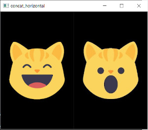
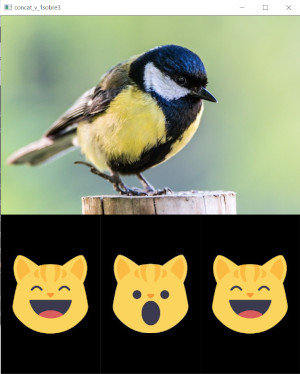
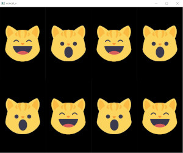

## 🖼️🖼️ CONCATENANDO IMÁGENES | OpenCV con Python

Para una descripción más detallada sobre el proceso de construcción de los programas, por favor dirígete a:

Mi blog: https://omes-va.com/concatenando-imagenes-opencv-con-python/

Video: https://youtu.be/Lh-bqvcAhfM

A continuación tenemos algunas imágenes resultantes.

